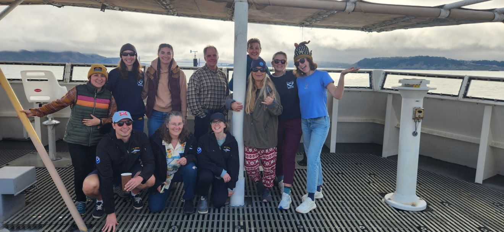

# Maddie Betts, M.S.

## About Me:

I am a fish ecologist and geneticist currently working as a contractor for NOAA's Northwest Fisheries Science Center. In my current role, I work on a variety of projects within the lab and in the field, with study species that range from marine mammals to giant manta rays and anadromous fishes. A large portion of my work centers on supporting the eDNA initiatives of the [Integrated West Coast Pelagics Survey](https://www.fisheries.noaa.gov/west-coast/science-data/integrated-west-coast-pelagics-survey). 

Although much of my current work is focused on marine ecology, my background reflects my deep interest in freshwater fish ecology. This fall, I will dive back into the freshwater world as I begin my PhD at the University of Vermont, where I will be studying the effects of angling on black bass populations on Lake Champlain.  

### The team I sailed with recently on the Bell M. Shimada as part of the IWCPS!

## Publications:

Betts, M. M., D. C. Haak, E. M. Hallerman, E. G. Maurakis, and E. A Frimpong. Reciprocal predation of embryonic fishes exposes selfishness by *Nocomis leptocephalus*. *In review*. 

Betts, M. M., E. A. Hultin, E. M. Hallerman, E. G. Maurakis, and E. A. Frimpong. Host-orchestrated embryonic selfish herd dynamics motivate acceptance of brood parasitism in the gravel nest of a stream fish. *In review*. 

Shelton, A. O., K. Nichols, K. M. Parsons, M. M. Betts, S. P. Engster, A. Ramón-Laca, M. Parsley, M. Shaffer, A. Wells. 2025. Developing an abundance index for pacific hake using environmental DNA (Appendix G in: Status of the Pacific Hake (whiting) stock in U.S. and Canadian waters in 2025). 286 p. [https://rdrr.io/github/pacific-hake/hake-assessment/f/doc/151-appendix-eDNA-index.rmd](https://rdrr.io/github/pacific-hake/hake-assessment/f/doc/151-appendix-eDNA-index.rmd)

Betts, M. M., N. Abaid, E. G. Maurakis, and E. A. Frimpong. 2024. Bluehead chub *Nocomis leptocephalus* hosts exploit selfish-herd benefits from their heterospecific nest associates. *Freshwater Biology*, 69, 450–459. [https://doi.org/10.1111/fwb.14224](https://onlinelibrary.wiley.com/doi/10.1111/fwb.14224).
